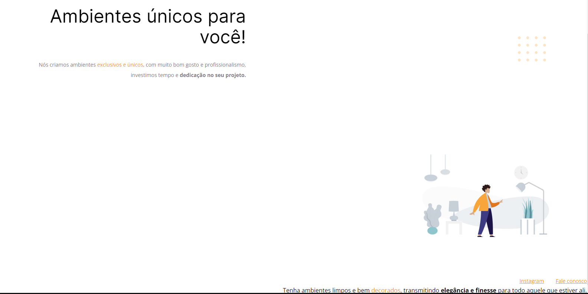
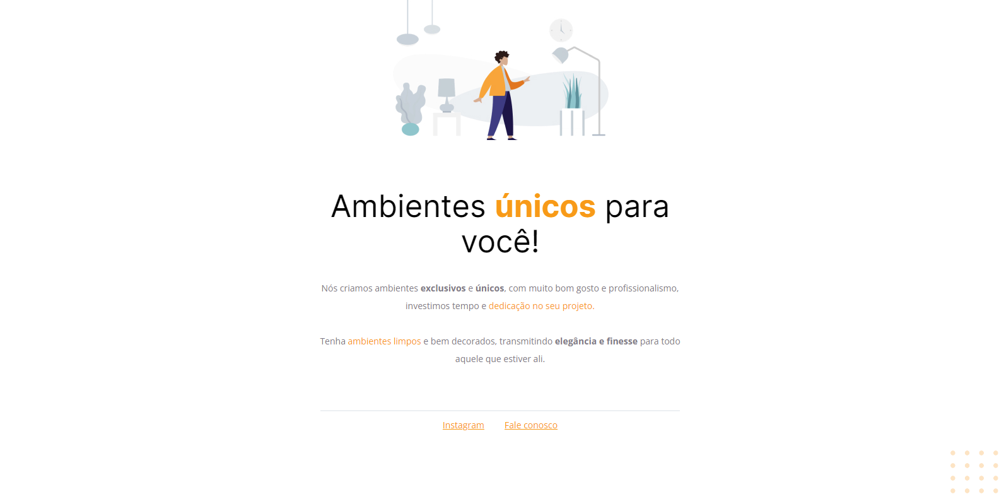

<h1 align="center">
	Iniciante Corrigindo bugs(01) - Stage 2 Explorer - Rocketseat 
</h1>

<h3 align="center">
	Primeiro desafio do stage 2 do treinamento explorer
</h3>
 

	
	
	
	
	

<h4 align="center">
	Status: 🚀 Finalizado
</h4>

	<a href="#about">Sobre</a> •
	<a href="#tech-stack">Tecnologias</a> 

## Sobre

Desafio proposto na trilha explorer que nos trouxeram um código cheio de bugs, formos proposto a fazer a correção de posicionamento de items e estilização das fontes

## Antes da estilização

## Depois da estilização

## Tecnologias

&nbsp;
&nbsp;
